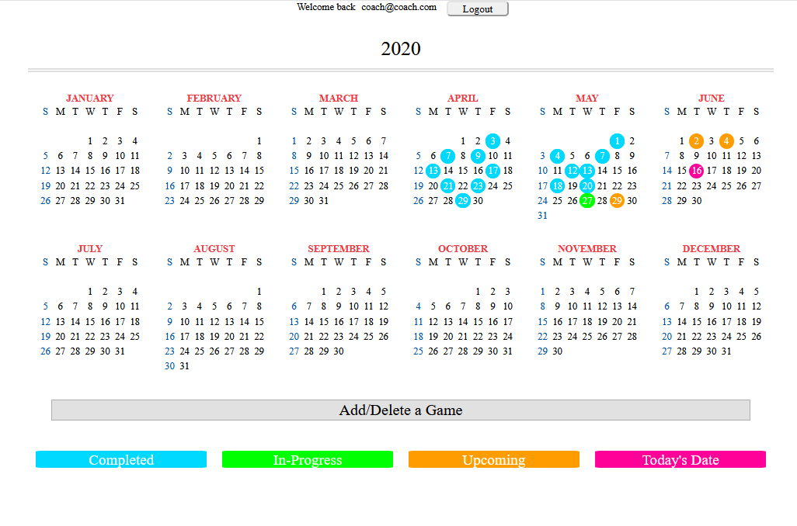

# Little League Logger (LLL)

## Overview

An Node.js/Express based application for Little League baseball teams. LLL keeps team members and their family members up-to-date on upcoming, current, and past games. With live score updating and scrolling gmae highlights.

## Deployment

Visit application by [Clicking Here](https://littleleaguelogger.herokuapp.com/)

View powerpoint presentation by [Clicking Here](https://docs.google.com/presentation/d/1hqtFRbs4SnInxHDeL7d3FcaWem7aLsqV5c5Ljsn6YG4/edit#slide=id.g73824109db_2_23)

## Application Walkthrough

### Navigating to the page will first bring the user to the login page if they hasn't already logged in recently. If they have the application will automatically redirect them to their calander page.

### Clicking 'Create Account' will pull up an account creation module. Coach accounts get special privleges and need a special password to obtain them.

### After logging in the user will be presented with a calander showing color coordinated game dates and today's date. Users can click on completed and in-progress games to view their stats. Coaches have hte option to add or delete games.

### After clicking on a game the user will be presented with a scoreboard displaying it's score and scrolling stats. Only coaches have the option to adjust game scores. Users can see these updates in real time.

## Application Information

Developed for two users: Coach and User

- User is only able to view game information.
- Coach is able to view, create new, and update game information.

- All users need to create an account using the their email address

  - Coaches will need to enter a password when creating their coach account to enable features.
  - Anyone can create a User account.
  - Passwords will be hashed with bcrypt then stored.

- Once logged in, the users can see the interactive calendar with completed, in-progress, and upcoming games.
- Coaches can create or delete games from the calendar page.
- Click on any completed or in-progress game to see it's stats.
- All users can view the current scores.

  - If a game is in progress, the user can see updates occur in real-time.
  - The comments ticker can be used to keep track of game highlights and send messages of encouragement to players.

- The coach has access to an update field that allows them to:
  - Input runs per inning for each team
  - Add an overtime field for extra innings
    - This will appear for general user as long as a score is put into one team's overtime field.
  - Reschedule the game
  - Change the game status from in-progress to game over or vice versa.
    - Will display "Game Over" on the page along with the winning team once changes to game over.
  - Coach can use Fix Game button to re-access the update fields for a later date
  
  
## Technology Used

- Javascript
- Node.js
  - Express
  - Express-Sessions
  - bcrypt
- HTML
- CSS
- Bootstrap
